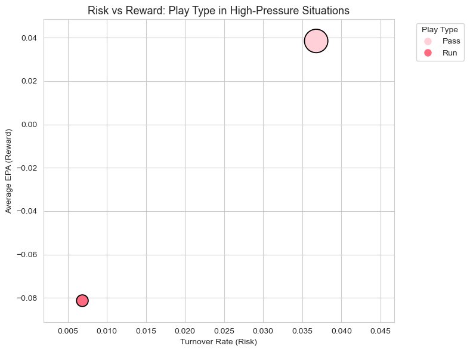
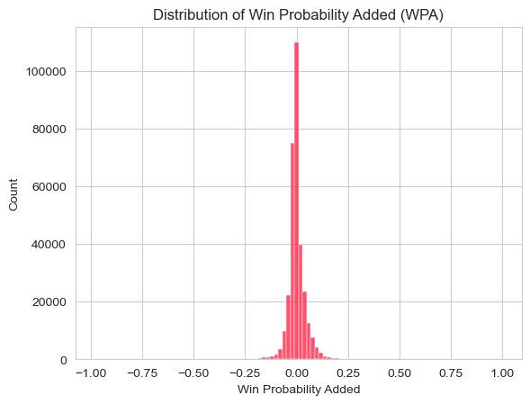

# nfl-under-pressure

## nfl-under-pressure

# 🏈 NFL Under Pressure  
### How High-Stakes Decisions Shape Outcomes

---

## Project Overview

In many real-world situations—business, finance, or operations—important decisions must be made under pressure, with limited time and incomplete information. The same is true in professional sports.

In American football (the NFL), games are made up of hundreds of individual plays. Most of these plays have little impact on the final outcome. However, in the final moments of close games, a single decision can dramatically change the chances of winning.

This project uses **NFL play-by-play data from 2009 to 2018** to study how teams make decisions in these high-pressure moments. The focus is not on football tactics, but on understanding **risk, reward, and decision-making under pressure**.

---

## Problem Statement

When games are close and time is running out, teams must choose between different strategies:

- **Passing plays** are generally more aggressive. They can create large gains quickly but also carry a higher risk of costly mistakes.
- **Running plays** are more conservative. They reduce the risk of mistakes but often produce smaller gains.

The central question of this project is:

> How do teams balance risk and reward when making decisions under pressure, and which choices are most likely to influence the outcome of a game?

---

## Data Source

The original dataset used in this project is the 'Detailed NFL Play-by-Play Data 2009-2018', available on Kaggle.  
Due to its large size, the raw dataset is not included in this repository. 

---

## Data 

- **Source:** NFL Play-by-Play Dataset (2009–2018)  
- **Structure:** Each row represents a single play during a game  
- **Scale:** Millions of plays across multiple seasons  

Key metrics used in the analysis include:

- **Expected Points Added (EPA):**  
  An estimate of how much a play increases or decreases a team’s expected future points.  
  - Positive EPA = beneficial outcome  
  - Negative EPA = harmful outcome  

- **Win Probability (WP):**  
  The estimated chance that a team will win the game at a given moment.

- **Win Probability Added (WPA):**  
  The change in win probability caused by a single play.

- **Turnovers:**  
  Plays where the offensive team loses possession of the ball, typically resulting in a large negative impact.

No prior knowledge of football is required to interpret these metrics—they simply measure **value, risk, and impact**.

---

## Methodology

To focus on meaningful decisions, the analysis isolates **high-pressure situations**, defined by:
- Plays in the **fourth quarter**
- Games with a **close score difference**
- Situations where time remaining is limited

Each play is evaluated based on:
- **Risk:** Likelihood of a turnover
- **Reward:** Average change in expected points (EPA)
- **Impact:** Effect on win probability (WPA)
- **Frequency:** How often each decision type is used

The workflow combines:
- **Python** for data cleaning, feature engineering, and analysis
- **Tableau** for interactive visualization and exploration

---

## Key Findings

- Aggressive decisions (passing plays) tend to generate **higher average value**, but also come with **significantly higher turnover risk**
- Conservative decisions (running plays) reduce risk but often produce **lower or negative expected value** in high-pressure situations
- Most plays have little effect on the final outcome, while a **small number of late-game plays account for a large share of outcome changes**
- Teams consistently accept higher risk in critical moments, suggesting that maximizing upside often outweighs minimizing mistakes

---

## Key Conclusions

- In high-pressure situations, aggressive decisions tend to produce higher rewards but also expose teams to significantly greater risk.
- Conservative strategies reduce the likelihood of costly mistakes, but often come at the expense of expected value.
- A small number of late-game decisions account for a disproportionate share of outcome changes, highlighting the importance of decision quality under pressure.

---

## 📊 Selected Visuals

### Risk–Reward Tradeoff in High-Pressure Situations

This scatter plot compares the risk (turnover rate) and reward (average Expected Points Added, EPA) of passing versus running plays during high-pressure moments.
Each point represents a play type, with bubble size indicating how frequently the decision occurs.
Passing plays generate higher rewards on average but come with a substantially higher risk of turnovers, while running plays are safer but tend to produce lower gains.

---

### Distribution of Win Probability Added (WPA)

This histogram shows how individual plays affect a team’s chance of winning.
Most plays cluster tightly around zero, meaning they have little impact on the game outcome, while a small number of rare plays dramatically shift win probability. These high-impact moments often occur under late-game or high-pressure conditions, highlighting where decisions matter most.

---

## Interactive Dashboard

An interactive Tableau dashboard accompanies this analysis and allows users to:
- Compare risk and reward across decision types
- Explore how outcomes change under pressure
- Identify the most game-changing plays in the final minutes
- Understand how rare but impactful decisions shape results

A Tableau-ready dataset is included in this repository.

---

## Tools Used

- **Python** (pandas, numpy, seaborn, matplotlib)
- **Tableau**
- **Jupyter Notebook**

---

## Why This Project Matters

Although this project uses football data, the underlying questions apply far beyond sports:

- How should decisions be made when stakes are high?
- When is it worth accepting additional risk for greater reward?
- How often do rare events dominate outcomes?

These same principles apply to risk management, project planning, operations, and strategy.

---

## Future Work

Potential extensions of this project include:
- Team- or coach-specific decision profiles
- Fourth-down decision-making analysis
- Studying how risk tolerance changes over time
- Applying the framework to other industries or domains

Studying how risk tolerance changes over time

Extending the framework to other sports or industries
